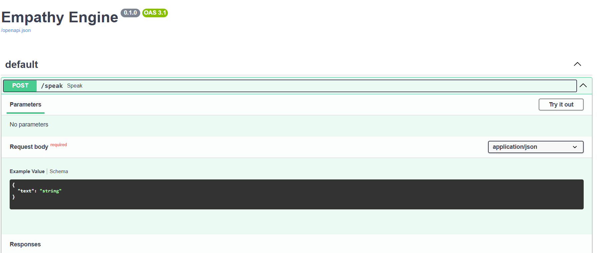
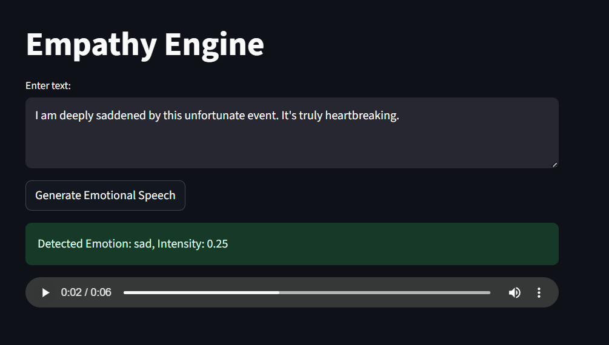

# 🎙️ Empathy Engine  (Assignment)

This project is an **Emotion-Aware Text-to-Speech (TTS) system** that detects emotions from input text and generates **emotionally aligned speech**.  
It combines **sentiment analysis** with **speech synthesis parameters** (rate, volume, voice) to make the output sound more human-like and empathetic.  

---

## 🚀 Features
- **Emotion Detection** → Uses `TextBlob` to analyze sentiment and map text into *happy*, *sad*, or *neutral* with intensity.  
- **Dynamic Speech Synthesis** → Adjusts speech **rate**, **volume**, and **voice** based on detected emotion and intensity.  
- **FastAPI Backend** → Exposes a `/speak` API endpoint to generate emotional speech.  
- **Streamlit Frontend** → Simple UI for users to input text and listen to emotional speech.  
- **Female Voice Support** → Configured `pyttsx3` to use a female voice (instead of default male).  

---

## 🛠️ Project Structure
```
.
├── app.py              # FastAPI backend (API to generate speech)
├── config.py           # Emotion mapping (rate, volume adjustments per emotion)
├── emotion_detector.py # Emotion detection using TextBlob sentiment analysis
├── streamlit_app.py    # Streamlit frontend UI
├── tts_engine.py       # Text-to-Speech generation logic
```

---

## ⚙️ How It Works
1. **User Input** → Text is entered via Streamlit frontend.  
2. **Emotion Detection** → `emotion_detector.py` uses sentiment polarity:  
   - Positive → Happy 😃  
   - Negative → Sad 😢  
   - Neutral → Neutral 😐  
   Intensity is scaled between 0 → 1.  
3. **Parameter Mapping** → In `config.py`, each emotion has base values for:  
   - Speech **rate** (words per minute)  
   - Speech **volume** (loudness)  
   - Variations depending on intensity  
4. **Speech Synthesis** → `tts_engine.py` uses `pyttsx3` to generate speech:  
   - Adjusts rate & volume dynamically  
   - Selects a **female voice** (`voices[1].id`)  
5. **API Response** → `app.py` streams back `.wav` audio to the frontend.  
6. **Frontend Playback** → Streamlit displays detected emotion + plays audio.  

---

## ▶️ Usage

Follow these steps to set up and run the project:

### 1️⃣ Clone the Repository
```bash
git clone https://github.com/Anshul21107/Empathy-Engine
cd Empathy-Engine
```

### 2️⃣Create & Activate Virtual Environment
```bash
python -m venv venv
venv\Scripts\activate
```

### 3️⃣ Install Dependencies
```bash
pip install -r requirements.txt
```

### 4️⃣Run Backend (FastAPI)
```bash
python app.py
```
### 5️⃣ Run Frontend (Streamlit)
```bash
streamlit run streamlit_app.py
```

### Example
- Input: `"I am so excited about this new project!"`  
- Detected: Emotion = `happy`, Intensity ≈ `0.9`  
- Output: Faster, louder, female-voiced audio with happy tone.  

---

## 📂 API Endpoint
**POST** `/speak`  
```json
{
  "text": "Your input sentence here"
}
```
**Response**: WAV audio stream + headers:  
- `X-Emotion`: Detected emotion  
- `X-Intensity`: Emotion intensity  

---

## Points
- Implemented **sentiment-based prosody control** (rate, volume, voice).  
- Used **FastAPI for scalable backend** + **Streamlit for quick prototyping UI**.  
- Showed ability to integrate **NLP + TTS + Web APIs**.  
- Designed `EMOTION_MAP` for **realistic emotion simulation**.  
- Extended TTS to **female voice selection** (instead of default male).  

--- 
## 📸 Screenshots

### 🔹 FastAPI Endpoint


### 🔹 Streamlit UI



## 🔊 Sample Audio Output

Here’s an example of **emotionally generated speech of this text: "I am deeply saddened by this unfortunate event. It's truly heartbreaking."**:

🎧 [▶️ Listen to This Example](temp_audio.wav)


---

## 👨‍💻 Author
Developed by **Anshul Katiyar**  
